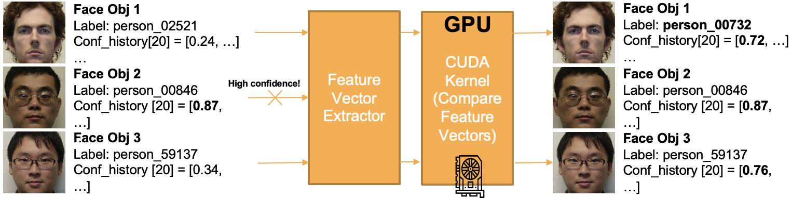

# Video Face Recognition vid Face Object

This repository is the official implementation of [https://www.dbpia.co.kr/Journal/articleDetail?nodeId=NODE09302060](https://www.dbpia.co.kr/Journal/articleDetail?nodeId=NODE09302060).



## Requirments

Code was tested in anaconda virtual environment with Python 2.7, CUDA ≥ 8.0

```jsx
make
```

```jsx
conda env create -f videoFR_requrements.yaml
```

## Face Recognition on video

This snipplet will infer your video to recognize registered face.

```bash
python videoFR_v4.py \
--display
--back r100
--db dohee_face
--gpu 0
--simal_gpu
```

**Arguments discription**

- display : display face recognition results
- back : facerecognition backbone network. [r50/ r100]
- record : store face recognition results
- db : registered face emb vector. if file exists, code will automatically load the db file. if not, code will generate db file
- gpu : gpu index
- simcal_gpu : parameter whether calculate cosine similarity using gpu or not

**Demo video**

[demo.mp4](figure/demo.mp4)